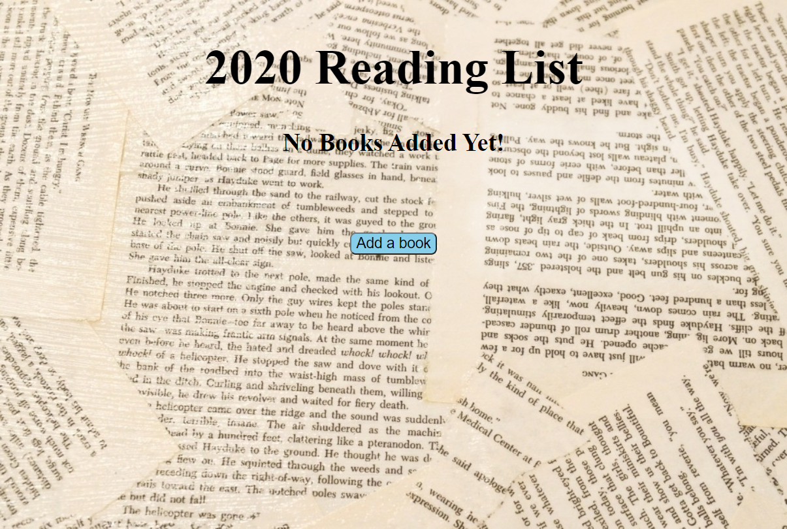
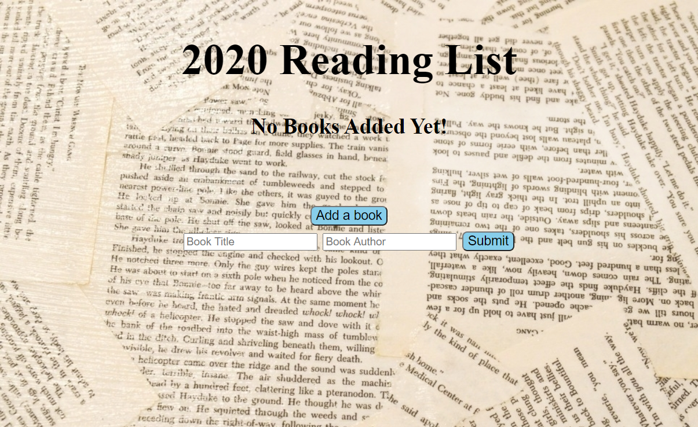
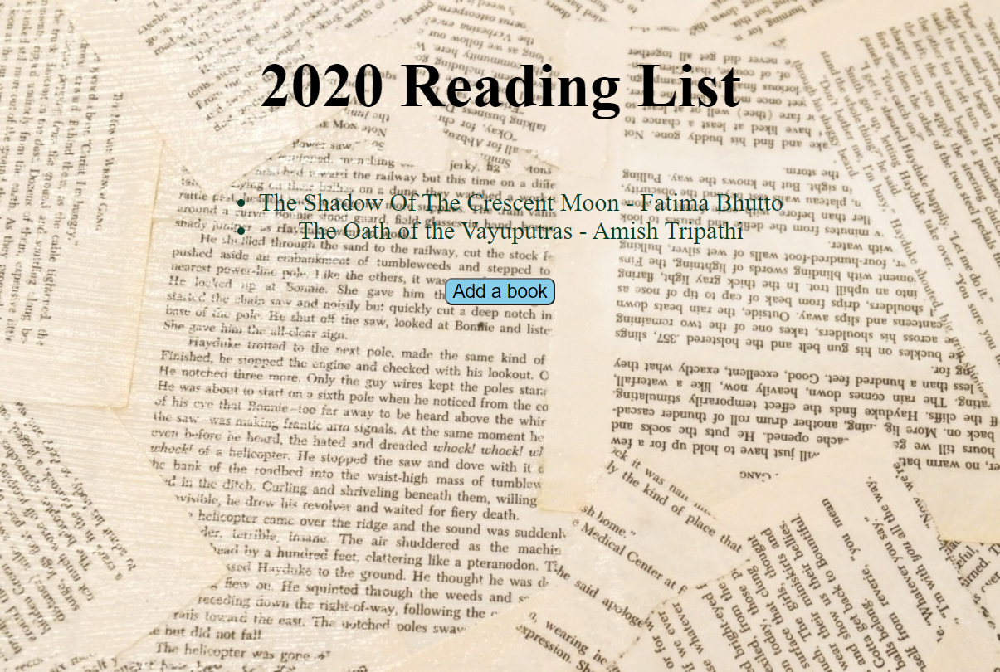

# Book-Library-Web_Application
This is a web application of book library where users can easily add books regarding the book name and its author information and then it will append to the lists. The list will be stored in the localstoage so upon refreshin the page the previous list will still appear in web page. Languages used here is HTML, CSS and JavaScript.

# Homepage

# Input form of book name and author

# List after added

